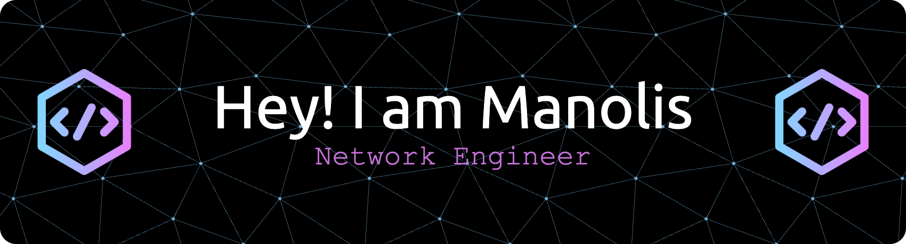

👋 - I am a seasoned network engineer learning to reinvent myself in the age of automation and cloud. With 25+ years of professional IT experience, I've spent most of my career building, operating, and maintaining reliable network infrastructures. Over the last few years, I've realised that the future of networking lies in automation, programmability and DevOps practices with the most important of them being collaboration, hence I am trying to move out of my comfort zone and chase the dream.

You can find more about me via my online CV [site](https://becos76.github.io), or read my [blog](https://net4fungr.github.io).

# My Stats

# My repos

## Mini/Weekend Projects

## Blog associated repos

## Website related
- [becos76.github.io](https://github.com/becos76/becos76.github.io): 
My online extensive resume with Hugo and gh-pages!
 

- [printCV](https://github.com/becos76/printCV): 
My online printable CV with Hugo and gh-pages
 

## Oldies
- [ansible](https://github.com/becos76/ansible): 
Baby steps in ansible. Very short collection of playbooks from back in the day 
 

- [basics](https://github.com/becos76/basics): 
Basic `pexpect` python script to get serial numbers from Cisco IOS devices using csv I/O
 

- [katacoda-scenarios](https://github.com/becos76/katacoda-scenarios): 
Example scenarios from when [katacoda.com](https://katacoda.com) was a thing!!
 

- [nornir-starters](https://github.com/becos76/nornir-starters): 
First steps with Nornir
 

- [node-server](https://github.com/becos76/node-server): 
Node.js in docker sample app
 

## Forks
- [ci-workshops-avd](https://github.com/becos76/ci-workshops-avd)
- [100-days-of-nautobot](https://github.com/becos76/100-days-of-nautobot)
- [autocon2-cicd-workshop](https://github.com/becos76/autocon2-cicd-workshop)
- [terraform-managing-network-infrastructure-4373320](https://github.com/becos76/terraform-managing-network-infrastructure-4373320)
- [container.training](https://github.com/becos76/container.training)
- [kne](https://github.com/becos76/kne)
- [learning_python](https://github.com/becos76/learning_python)
- [python-demoapp](https://github.com/becos76/python-demoapp)
- [app-first-security-jenkins-code](https://github.com/becos76/app-first-security-jenkins-code)
- [cicd-pipeline-train-schedule-git](https://github.com/becos76/cicd-pipeline-train-schedule-git)
- [pyneng-examples-exercises-en](https://github.com/becos76/pyneng-examples-exercises-en)